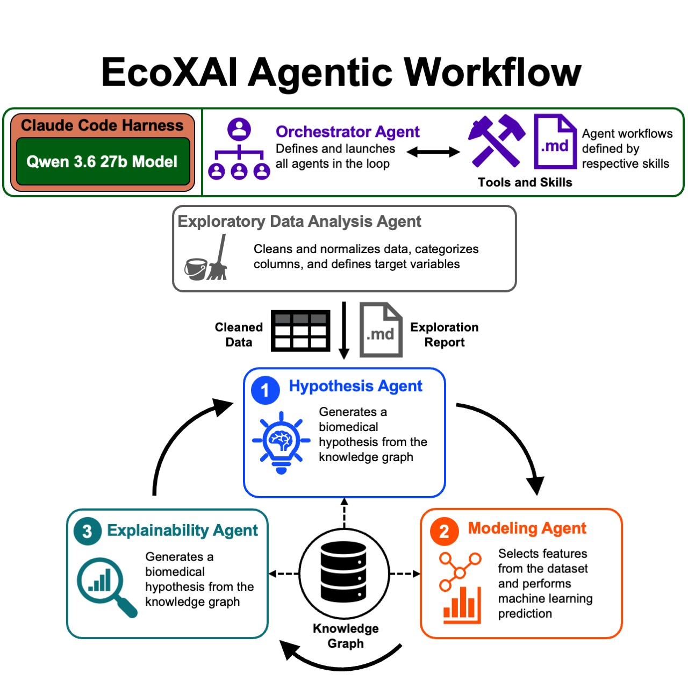

# EcoXAI

**EcoXAI** is a knowledge graph-grounded multi-agent framework for autonomous biomedical discovery. Rather than executing a fixed machine learning pipeline, EcoXAI performs an iterative scientific workflow that combines exploratory data analysis, hypothesis generation, hypothesis-specific validation, and discovery memory. AI agents operate inside isolated Docker containers while a planner orchestrates the end-to-end research loop and tracks every experiment for reproducibility. The frontend provides real-time monitoring, experiment inspection, and hypothesis management.



---

## Features

### EcoXAI GUI

| View | Description |
|------|-------------|
| **Datasets** | Upload and manage datasets; add research context and a guiding research question per dataset |
| **Pipeline** | Monitor live job execution across all stages; view logs, artifacts, and per-job cost in real time |
| **Hypotheses** | Browse, filter, and inspect all generated hypotheses with their status (supported / rejected / needs more data) |
| **Skills** | Browse, create, filter, and inspect all available skills |
| **Settings** | Configure the API budget limit and other runtime parameters |

### Pipeline Stages

| Stage | Description |
|-------|-------------|
| **Normalize** | Structural analysis, content canonicalization, semantic extraction, confidence scoring, and provenance tracking |
| **Explore** | Exploratory data analysis; produces a summary report and key statistics artifacts |
| **Hypothesize** | Generates ranked candidate biomedical hypotheses grounded in the explored data |
| **Test/Validate** | Iteratively evaluates the hypothesis against the dataset, producing a detailed report (parallelizable) |

---

## Quick Start Tutorial

### 1. Upload a dataset

Drop a `.csv`, `.json`, or `.feather` file into `ecoxai/backend/datasets/`. The server detects the file and begins ingestion automatically — no restart needed.

### 2. Add context

Open the **Datasets** view in the browser (`http://localhost:8081`). Click your dataset to open its detail panel. Fill in:
- **Description** — what the data represents
- **Research Question** — the scientific question you want the pipeline to answer

This context is injected into every agent prompt, grounding hypothesis generation. Click **Start Pipeline** to start the pipeline.

### 3. Watch the pipeline run

Switch to the **Pipeline** view. Each stage card shows its current status (queued → running → complete). Click a stage to expand its live log stream, view cost, and download artifacts. If you would like to alter the behavior of the pipeline, you can click on the respective pipeline stage to open the configuration panel, where you can not only add or remove skills, but also modify the prompt of the stage itself. After the hypothesis generation stage completes, there will be a new list of hypotheses in the **Hypotheses** view and will be a queue of hypotheses to be evaluated. Based on how many concurrent evaluation jobs you have configured, the pipeline will evaluate the hypotheses in parallel. (Default is 2).

### 4. Review hypotheses

Open the **Hypotheses** view as you will see the list of hypotheses generated by the **Hypothesize** stage. Hypotheses are listed and tagged with their evaluation status after the **Test/Validate** stage runs. Each hypothesis contains a detailed markdown report of the results. This will be updated as the pipeline runs.

### 5. Reset and iterate

To wipe all state and start fresh with a new dataset:
```bash
cd ecoxai/backend
./reset.sh
```

---

## Prerequisites

- **Docker** must be running and the `ecoxai-agent` image must be built (see below)
- **Node.js 20+**
- An Anthropic API key (direct or via Azure Foundry)

---

## Setup

### 1. Environment Variables

**Direct Anthropic API:**
```bash
export ANTHROPIC_API_KEY=...
```

**Azure Foundry (alternate):**
```bash
export CLAUDE_CODE_USE_FOUNDRY=1
export ANTHROPIC_FOUNDRY_RESOURCE=...
export ANTHROPIC_FOUNDRY_API_KEY=...
export ANTHROPIC_DEFAULT_SONNET_MODEL='claude-sonnet-4-6'
```

**Local model (OpenAI-compatible server, e.g. llama.cpp):**
```bash
export ANTHROPIC_BASE_URL="http://localhost:8001"
export ANTHROPIC_API_KEY='sk-no-key-required'
export CLAUDE_MODEL='unsloth/Qwen3.6-27B-MTP-GGUF:UD-Q4_K_XL'
```
> The backend automatically rewrites `localhost` to `host.docker.internal` when passing the URL into Docker containers.

### 2. Build the Agent Docker Image

```bash
cd ecoxai/backend/docker
docker build -t ecoxai-agent -f Dockerfile.agent .
```

### 3. Start the Backend

```bash
cd ecoxai/backend
npm install
npm start
```

### 4. Run the Frontend Dev Server

```bash
cd ecoxai/frontend
python3 -m http.server 3000
```

### 5. (Optional) Reset the dataset and pipeline state

```bash
cd ecoxai/backend
./reset.sh
```

---

## Budget Tracking

Each completed agent container reports its cost in USD. Costs are accumulated in backend state and compared against a configurable budget limit before any new job is started. The budget limit can be adjusted in the Settings view of the GUI.
